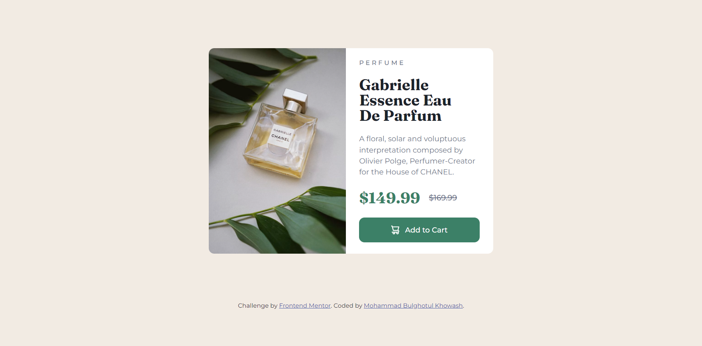

# Frontend Mentor - Product preview card component solution

This is a solution to the [Product preview card component challenge on Frontend Mentor](https://www.frontendmentor.io/challenges/product-preview-card-component-GO7UmttRfa). Frontend Mentor challenges help you improve your coding skills by building realistic projects. 

## Table of contents

- [Overview](#overview)
  - [The challenge](#the-challenge)
  - [Screenshot](#screenshot)
  - [Links](#links)
- [My process](#my-process)
  - [Built with](#built-with)
- [Author](#author)
- [Acknowledgments](#acknowledgments)

## Overview

### The challenge

Users should be able to:

- View the optimal layout depending on their device's screen size
- See hover and focus states for interactive elements

### Screenshot

### Links

- Solution URL: [Add solution URL here](https://www.frontendmentor.io/solutions/responsive-product-preview-card-component-with-vanilla-css-gATYwRf0-r)
- Live Site URL: [Add live site URL here](https://mohammadbulghotulkhowash.github.io/product-preview-card-component.github.io/y)

## My process

### Built with

- Semantic HTML5 markup
- CSS custom properties
- Flexbox
- CSS Grid

## Author

- Instagram - [@mohammad_bulghotul](https://www.instagram.com/mohammad_bulghotul?igsh=MXB4djU3YXRhejNheA==)
- Frontend Mentor - [@MohammadBulghotulKhowash](https://www.frontendmentor.io/profile/MohammadBulghotulKhowash)
- LinkEdin - [Mohammad Bulghotul Khowash](https://www.linkedin.com/in/mohammad-bulghotul-khowash-78773a2a7?utm_source=share&utm_campaign=share_via&utm_content=profile&utm_medium=android_app )

## Acknowledgments

This is where you can give a hat tip to anyone who helped you out on this project. Perhaps you worked in a team or got some inspiration from someone else's solution. This is the perfect place to give them some credit.
